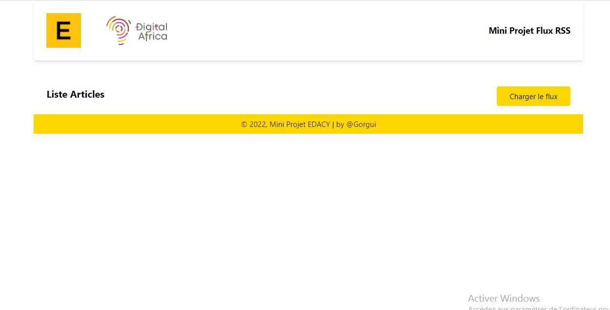

# Manuelle d'installation de l'application

## Prérequis :
**Vous devez avoir [Node](https://nodejs.org/en/download/), [NPM](https://docs.npmjs.com/downloading-and-installing-node-js-and-npm) et [Angular CLI](https://angular.io/guide/setup-local) installés sur votre poste.**

**Le back-end de ce projet est dans le repository back-projet-edacy**

## Procédure d'installation

1. **Cloner le projet**

`git clone https://github.com/Gorgui2013/back-projet-edacy.git`

2. **Déplacer dans le projet**

`cd front-projet-edacy`

3. **Installer les dépendances**

`npm install`

4. **Démarer l'application**

`ng serve`

5. **Accéder à l'application via un navigateur sur le lien suivant**

`http://localhost:4200`

6. **Une foi l'application démarée, cliquer sur le button charger le flux pour recupérer le flux RSS**

